# 1/ Code for reading in the dataset and/or processing the data


```r
# Loading and preprocessing the data
# Loading packages needed

library(dplyr)
library(ggplot2)
library(gridExtra)

# Setting the current directrory
setwd("C:/Users/maele/Documents/WORK/JHOPKINS/Reproducible_research/RepData_PeerAssessment1")
temp <- paste0(getwd(),"/tmp")

# Loading the datas from the web
download.file(url = "https://d396qusza40orc.cloudfront.net/repdata%2Fdata%2Factivity.zip", destfile=temp)
unzip(temp)

# Loading csv file into a data frame
df <- read.csv("activity.csv")

# In order not to reprocess from scratch with the download every time we work on the project, following is possible :
# Loading the datas into a data frame in our local environment
# save(df,file = "df.Rda")
# load(file="df.Rda")
```

# 2/ Histogram of the total number of steps taken each day


```r
# Calculate total number of steps per day
df_steps_per_day <- df %>% select(steps,date) %>% filter(!is.na(steps)) %>% mutate(date = as.Date(date)) %>% group_by(date) %>% summarize(steps=sum(steps))


# It seems it is more a bar plot that is requested here than an histogram
first_plot <- df_steps_per_day %>% ggplot(aes(x = date,y=steps)) + geom_bar(stat="identity") + ggtitle("Number of steps taken per day") + theme(plot.title = element_text(hjust = 0.5, face = "bold"), axis.text.x = element_text(angle=45)) + scale_x_date(date_labels = "%Y-%m-%d") + scale_x_continuous(breaks = seq(from = as.Date("2012-10-01"),to = as.Date("2012-11-30"),by = 3) ) + labs(x="Date",y="Steps")
# Display plot
first_plot
```

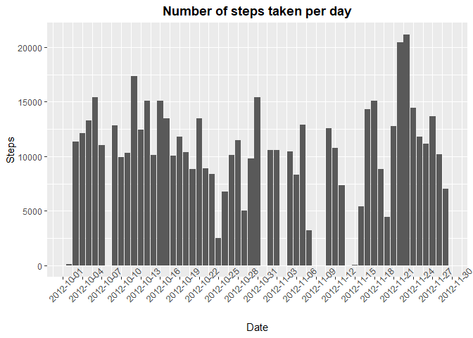<!-- -->

```r
#ggsave("1-Number of steps taken per day.png",first_plot)
```

# 3/ Mean and median number of steps taken each day


```r
# Calculate the mean and displaying the mean on the graph
steps_per_day_mean <- mean(df_steps_per_day$steps)
second_plot <- first_plot + geom_hline(yintercept = steps_per_day_mean, color = "red") + geom_text(x=as.Date("2012-10-07"),y = 20000, label = paste("Steps mean =", format.default(steps_per_day_mean,2)), color = "red") + ggtitle("Number of steps taken per day with mean")
# Display plot
second_plot
```

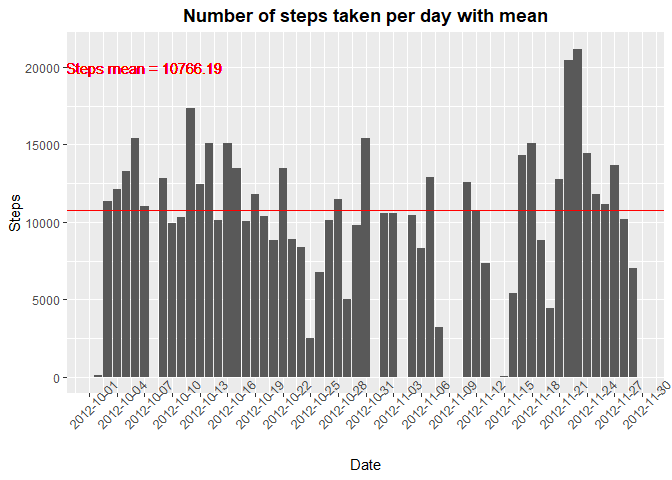<!-- -->

```r
#ggsave("2-Number of steps taken per day with mean.png",second_plot)

# Calculate the median and displaying it on the graph
steps_per_day_median <- median(df_steps_per_day$steps)
third_plot <- second_plot + geom_hline(yintercept = steps_per_day_median, color = "blue") + geom_text(x=as.Date("2012-10-28"),y = 20000, label = paste("Steps median =", steps_per_day_median), color = "blue") + ggtitle("Number of steps taken per day with mean and median")
#Display plot
third_plot
```

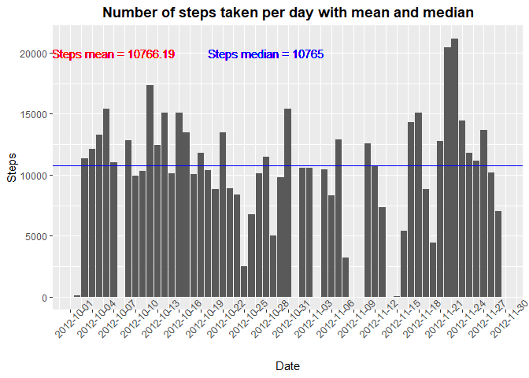<!-- -->

```r
#ggsave("3-Number of steps taken per day with mean and median.png",third_plot)
```

# 4/ Time series plot of the average number of steps taken


```r
## What is the average daily activity pattern?
# Compute average steps for each interval across all days
df_steps_per_interval <- df %>% filter(!is.na(steps)) %>%  group_by(interval) %>% summarize(steps_mean = mean(steps))

fourth_plot <- df_steps_per_interval %>% ggplot(aes(x=interval, y = steps_mean)) + geom_line() + labs(title= "Average number of steps taken accross an average day", x="Steps mean", y = "Interval") + theme(plot.title = element_text(hjust = 0.5, face = "bold"))
# Display plot
fourth_plot
```

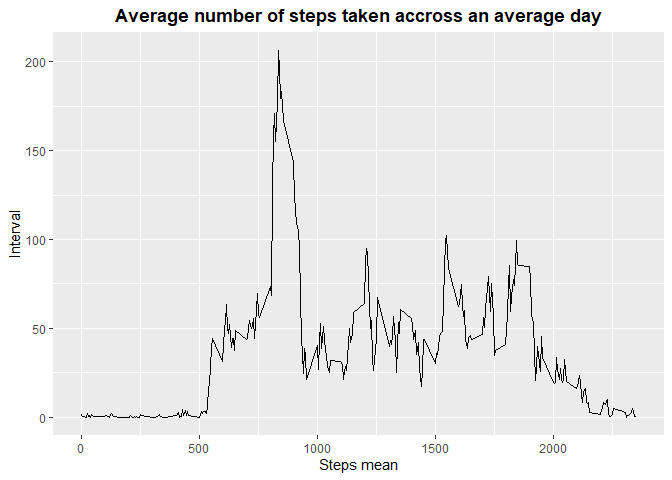<!-- -->

```r
#ggsave("4Average number of steps taken accross an average day.png",fourth_plot)
```

# 5/ The 5-minute interval that, on average, contains the maximum number of steps


```r
# Compute the max
max_steps <- df_steps_per_interval$interval[which.max(df_steps_per_interval$steps_mean)]

# Adding the max with a vertical lin on the plot
fifth_plot <- fourth_plot + geom_vline(xintercept = max_steps, color = "red") + geom_text(x=1200,y=200, label = paste("Maximum steps per day =",max_steps), color = "red")
# Display plot
fifth_plot
```

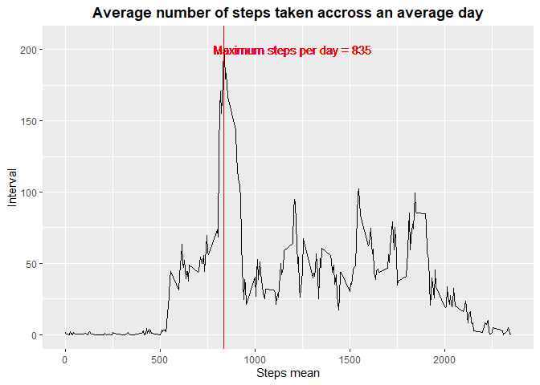<!-- -->

```r
#ggsave("5 - Average number of steps taken accross an average day with max.png",fifth_plot)
```

# 6/ Code to describe and show a strategy for imputing missing data


```r
# Explorting missing values
# Number of missing values in the dataset
sum(is.na(df$steps))
```

```
## [1] 2304
```

```r
# In percent
sum(is.na(df$steps))/nrow(df) *100
```

```
## [1] 13.11475
```

```r
# Exploring na's
df_nas <- df %>% filter(is.na(steps))

# Histogram of nas accross days
sixth_plot <- df_nas %>% ggplot(aes(x = as.Date(date))) + geom_histogram() + scale_x_continuous(breaks = seq(from = as.Date("2012-10-01"),to = as.Date("2012-11-30"),by =2)) + theme(axis.text.x = element_text(angle=90)) + labs(title="Number of Na's per day",y="Na's count", x = "Date") + theme(plot.title = element_text(hjust = 0.5, face = "bold"))
sixth_plot
```

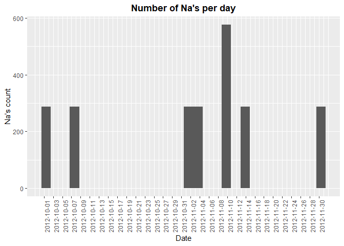<!-- -->

```r
# ggsave("6 - Number of nas per day.png",sixth_plot)

# Max frequence of Nas
nas_per_day <- df_nas %>% group_by(date) %>% summarize(sum(is.na(steps)))
nas_per_day
```

```
## # A tibble: 8 × 2
##   date       `sum(is.na(steps))`
##   <chr>                    <int>
## 1 2012-10-01                 288
## 2 2012-10-08                 288
## 3 2012-11-01                 288
## 4 2012-11-04                 288
## 5 2012-11-09                 288
## 6 2012-11-10                 288
## 7 2012-11-14                 288
## 8 2012-11-30                 288
```

```r
# Reduce binwidth to 1
seventh_plot <- df_nas %>% ggplot(aes(x = as.Date(date))) + geom_histogram(binwidth=1) + scale_x_continuous(breaks = seq(from = as.Date("2012-10-01"),to = as.Date("2012-11-30"),by = 2)) + labs(title="Number of Na's per day binwidth=1",y="Na's count", x = "Date") + theme(axis.text.x = element_text(angle=90)) + theme(plot.title = element_text(hjust = 0.5, face = "bold"))
seventh_plot
```

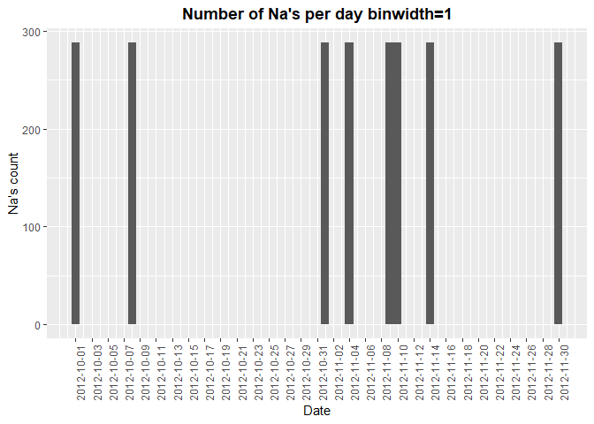<!-- -->

```r
#ggsave("7 - Number of Na's per day binwidth=1.png",seventh_plot)

# Explore another axes : missing values per interval

eight_plot <- df_nas %>% ggplot(aes(x=interval)) + geom_histogram(binwidth = 1) + scale_x_continuous(breaks=seq(from = 0, to = 2355, by =50)) + labs(title="Number of Na's per interval",y="Na's count", x = "Interval") + theme(axis.text.x = element_text(angle=90)) + theme(plot.title = element_text(hjust = 0.5, face = "bold"))
eight_plot
```

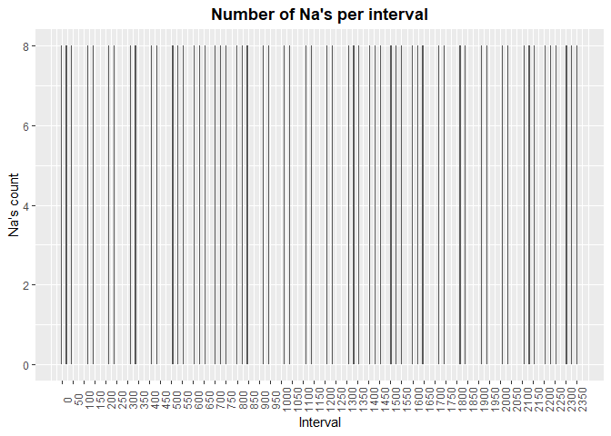<!-- -->

```r
#ggsave("8 - Number of nas per interval.png",eight_plot)


# Conclusion  : Na's have the same repartitions across intervalls. For each interval within the range 0 to 2355s, there is 8 Na's corresponding to eight missing data day's
# Given these observations, in our mind, the best manner to input Nas would be to fill the blanks with the per interval number of steps mean or median (not the per day number of steps if we want the maximum granularity)
```


```r
# Imputing missing values with the mean of steps per interval

df_without_nas <- df %>% filter(!is.na(steps))
df_nas_imputed <- df_nas %>% left_join(df_steps_per_interval, by = c("interval"="interval"))
df_nas_imputed <- df_nas_imputed %>% select(-steps) %>% rename(steps=steps_mean)

# recompile the full data frame
df_clean <- rbind(df_without_nas,df_nas_imputed)
```


# 7/ Histogram of the total number of steps taken each day after missing values are imputed


```r
# Here we play again the same operations as in 2/ but on df_clean this time
# Calculate total number of steps per day
df_clean_steps_per_day <- df_clean %>% select(steps,date) %>% mutate(date = as.Date(date)) %>% group_by(date) %>% summarize(steps=sum(steps))


# It seems it is more a bar plot that is requested here than an histogram
ninth_plot <- df_clean_steps_per_day %>% ggplot(aes(x = date,y=steps)) + geom_bar(stat="identity") + ggtitle("Number of steps taken per day - Nas's imputed dataframe") + theme(plot.title = element_text(hjust = 0.5, face = "bold"), axis.text.x = element_text(angle=45)) + scale_x_date(date_labels = "%Y-%m-%d") + scale_x_continuous(breaks = seq(from = as.Date("2012-10-01"),to = as.Date("2012-11-30"),by = 3) ) + labs(x="Date",y="Steps")
# Display plot
ninth_plot
```

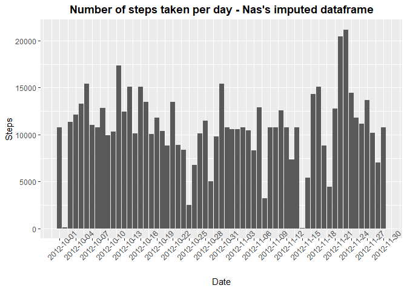<!-- -->

```r
#ggsave("9 - Number of steps taken per day - Nas's imputed dataframe.png",ninth_plot)

steps_per_day_clean_df_mean <- mean(df_clean_steps_per_day$steps)
steps_per_day_clean_df_median <- median(df_clean_steps_per_day$steps)

tenth_plot <- ninth_plot + geom_hline(yintercept = steps_per_day_clean_df_mean, color = "red") + geom_text(x=as.Date("2012-10-07"),y = 20000, label = paste("Steps mean =", format.default(steps_per_day_clean_df_mean,2)), color = "red") + ggtitle("Number of steps taken per day - Na's imputed dataframe - with mean and median") + geom_hline(yintercept = steps_per_day_clean_df_median, color = "blue") + geom_text(x=as.Date("2012-10-28"),y = 20000, label = paste("Steps median =", format.default(steps_per_day_clean_df_median,2)), color = "blue") 
tenth_plot
```

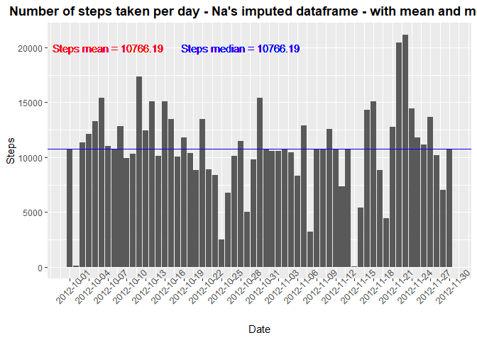<!-- -->

```r
# ggsave("10 - Number of steps taken per day - Nas's imputed dataframe.png",tenth_plot)


comparison_plot <- grid.arrange(third_plot,tenth_plot,nrow=2)
```

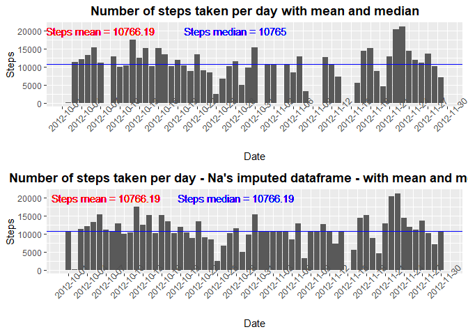<!-- -->

```r
# Display 
comparison_plot
```

```
## TableGrob (2 x 1) "arrange": 2 grobs
##   z     cells    name           grob
## 1 1 (1-1,1-1) arrange gtable[layout]
## 2 2 (2-2,1-1) arrange gtable[layout]
```

```r
#ggsave("11 - Number of steps taken per day - comparison without and with nas imputed.png",comparison_plot)


# Conclusion : imputing Na's didn't really change the mean and the median
# It produced a slight change on the median, but nothing significant
# In this new version of our dataset, mean equal median
```

# 8/ Panel plot comparing the average number of steps taken per 5-minute interval across weekdays and weekends


```r
# Reshape the dataframe for our purpose

df_clean <- df_clean %>%  mutate(day_of_week = weekdays(as.Date(date)))
unique(df_clean$day_of_week)
```

```
## [1] "mardi"    "mercredi" "jeudi"    "vendredi" "samedi"   "dimanche" "lundi"
```

```r
df_clean <- df_clean %>% mutate(is_weekend = as.factor(ifelse(day_of_week %in% c("samedi","dimanche"),"weekend","weekday")))

# Exploring the behaviour of the two groups of datas we created

df_steps_per_interval_wkday <- df_clean %>%  group_by(is_weekend,interval) %>% summarize(steps_mean = mean(steps))

stats <- df_clean %>% group_by(is_weekend) %>% summarize(mean = mean(steps)) 


eleventh_plot <- df_steps_per_interval_wkday %>% ggplot(aes(x=interval, y = steps_mean)) + geom_line() + facet_grid(is_weekend~.)+ labs(title= "Average number of steps taken accross an average day", x="Steps mean", y = "Interval") + theme(plot.title = element_text(hjust = 0.5, face = "bold"))

# Display plot
eleventh_plot
```

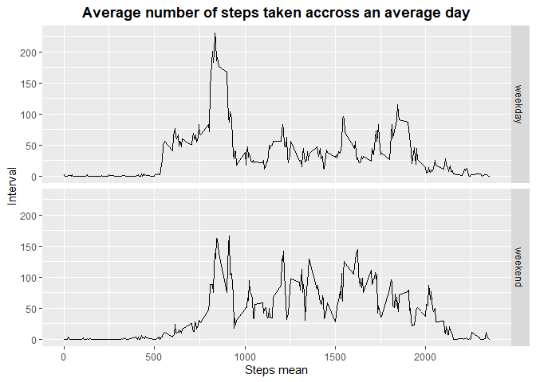<!-- -->

```r
# ggsave("12 - Average number of steps taken accross an average day - facet by day type.png",eleventh_plot)

twelvth_plot <- df_steps_per_interval_wkday %>% ggplot(aes(x=interval, y = steps_mean)) + geom_line() + facet_wrap(~is_weekend)+ labs(title= "Average number of steps taken accross an average day", x="Steps mean", y = "Interval") + theme(plot.title = element_text(hjust = 0.5, face = "bold")) + geom_hline(data = stats, mapping = aes(yintercept = mean))

# Display plot
twelvth_plot
```

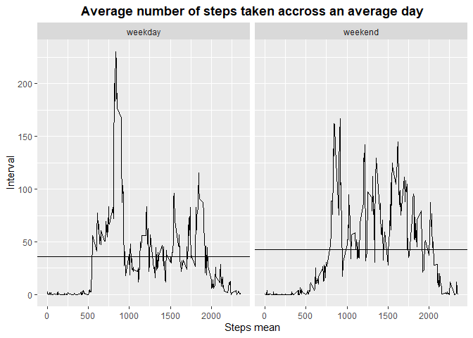<!-- -->

```r
# ggsave("13 - Average number of steps taken accross an average day - facet by day type rows.png",twelvth_plot)
```

## Are there differences in activity patterns between weekdays and weekends?

Activity seems to start and end sooner in weekdays than weekend days.
There's also a high pick of activity around 8 a.m in weekdays, whereas activity appears to be distributed more equally along the day in the weekends
According to the mean, activity seems to be higher in the week-ends (42.4 steps per interval during weekend whereas 35.6 steps per interval during weekdays)


--


